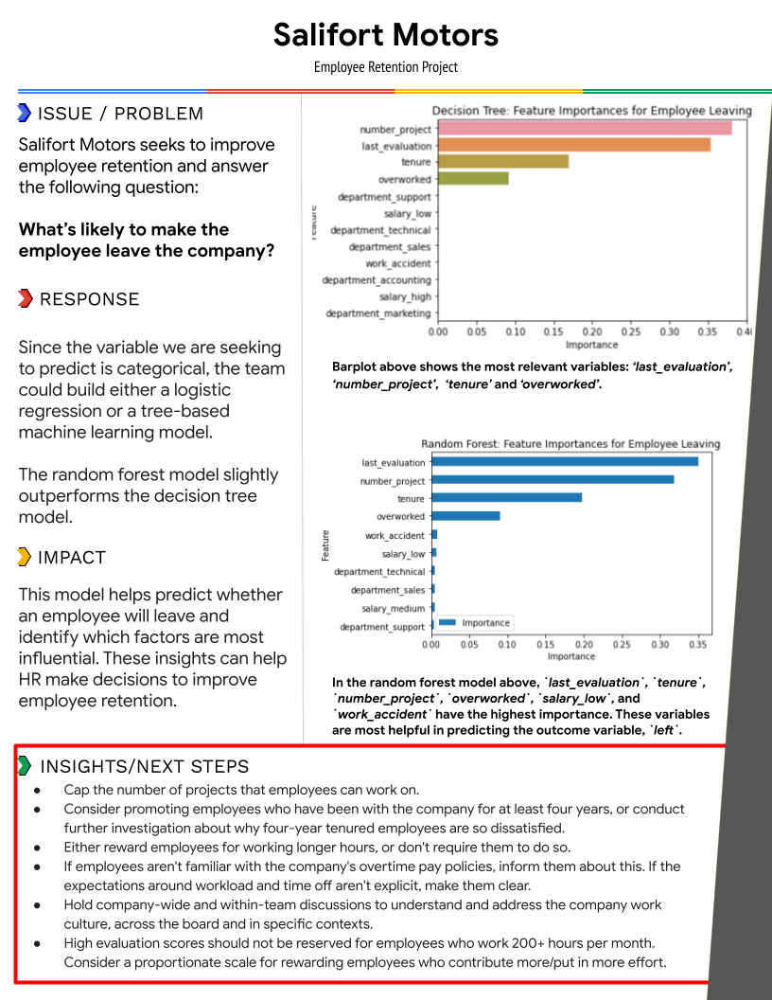

# Employee Turnover Prediction

## Project Description

In this project, I analyze employee turnover data for Salifort Motors, a multinational vehicle manufacturing company, to help predict whether employees are likely to leave the company. The goal is to identify key factors driving turnover and create predictive models that will help Salifort reduce turnover rates and improve employee satisfaction.

## Technologies Used

- **Languages**: Python
- **Libraries**: `pandas`, `numpy`, `scikit-learn`, `matplotlib`, `seaborn`, `xgboost`
- **Tools**: Jupyter Notebooks, Matplotlib for data visualization

## Dataset

The dataset used in this project, `HR_capstone_dataset.csv`, consists of 14,999 employee records, each providing self-reported information across 10 columns:

| Column Name           | Data Type | Description |
|-----------------------|-----------|-------------|
| satisfaction_level     | int64     | Employee's self-reported satisfaction level [0-1] |
| last_evaluation        | int64     | Score of employee's last performance review [0-1] |
| number_project         | int64     | Number of projects employee contributes to |
| average_monthly_hours  | int64     | Average monthly working hours |
| time_spend_company     | int64     | Number of years with the company |
| work_accident          | int64     | Whether the employee experienced a work accident (0 = no, 1 = yes) |
| left                   | int64     | Whether the employee left the company (0 = no, 1 = yes) |
| promotion_last_5years  | int64     | Whether the employee was promoted in the last 5 years |
| department             | str       | The employee's department |
| salary                 | str       | Employee's salary level (low, medium, high) |

## Project Structure

```
/data                    # Contains raw dataset
/notebooks               # Jupyter notebooks for data exploration, visualization, and modeling
/scripts                 # Python scripts for model evaluation
/reports                 # Executive summary, PACE document, and reports
```

## Executive Summary

The image below summarizes the findings and insights gained from the data analysis and model building phases. The Random Forest model slightly outperforms the Decision Tree model, highlighting key features like `number_project`, `last_evaluation`, `tenure`, and `overworked`.



## Jupyter Notebook

The detailed steps for the model building and evaluation are available in the Jupyter notebook. This includes data cleaning, feature engineering, model training, and evaluation.

- [Salifort_Motors_Code.ipynb](notebooks/Salifort_Motors_Code.ipynb)
